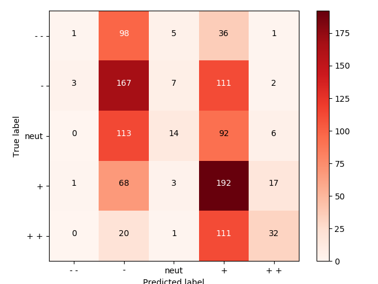

# CS224N Assignments
    Solutions for cs224n(Deep Learning For Natural Language Processing) course by stanford university
## Prerequisites
1. Install [Anaconda](https://www.continuum.io/downloads "Anaconda Official Website")
2. go to assignmentX where X is either 1, 2, 3 using a Terminal:
    ```sh
    $ cd \path\to\assignment1
    ```
3. create a python 2.7 environnment using
    ```sh
    $ conda env -n cs224n python=2.7 anaconda
    ```
4. activate your environment using (add source before activate if you're working with Linux/Mac)
    ```sh
    $ activate cs224n
    ```
5. install the dependencies using requirements.txt
    ```sh
    $ pip install -r requirements.txt
    ```
6. Don't forget to deactivate your environment when you're done (add source before deactivate if you're on Linux/Mac)
    ```sh
    $ deactivate cs224n
<!-- ## Running the tests

Explain how to run the automated tests for this system

### Break down into end to end tests

Explain what these tests test and why

```
Give an example
```

### And coding style tests

Explain what these tests test and why

```
Give an example
``` -->

## Deployment

### Assignment 1

#### Word2vec
Steps for training Word2vec in assignment 1 :
1. Go to folder /assignment 1
2. Run get_datasets.sh(By running this file you can download datasets)
3. Open a terminal and write(Be careful, for this assignment you should have installed python2.7) : 
    ```sh
    $ python q3_run.py
    ```
## Results

### Assignment 1 
#### Word2vec

### Sentiment analysis train/dev accuracy 

### Sentiment analysis truth table 

## Built With

* [Numpy](http://www.numpy.org/) - A library for doing optimized matrix operations
* [Matplotlib](https://matplotlib.org/) - A library for visulizing our outputs as graphs
* [scipy](https://www.scipy.org/) - A Library for doing mathematic, science and engineering stuff.
* [sklearn](http://scikit-learn.org/stable/) - Simple and efficient Library for data mining and data analysis
<!-- ## Contributing

Please read [CONTRIBUTING.md](https://gist.github.com/PurpleBooth/b24679402957c63ec426) for details on our code of conduct, and the process for submitting pull requests to us.

## Versioning

We use [SemVer](http://semver.org/) for versioning. For the versions available, see the [tags on this repository](https://github.com/your/project/tags).  -->

<!-- ## Authors

* **Erfan Miahi** - *Initial work* - [PurpleBooth](https://github.com/erfanMhi) -->

<!-- See also the list of [contributors](https://github.com/your/project/contributors) who participated in this project. -->

## License

This project is licensed under the MIT License - see the [LICENSE.md](LICENSE.md) file for details

<!-- ## Acknowledgments

* Hat tip to anyone whose code was used
* Inspiration
* etc

## Assignment 1

### Word2vec output

### Sentiment output -->
